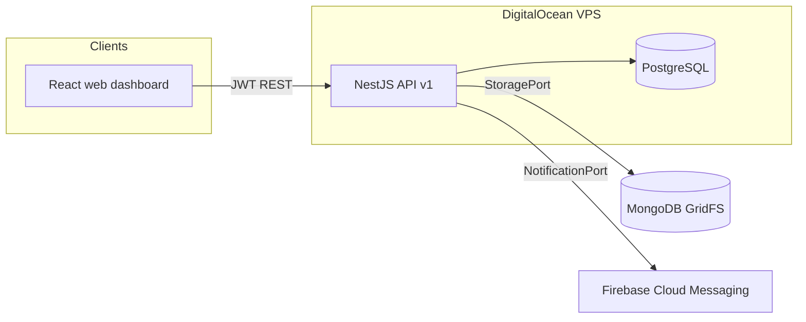

# Architecture

## System overview

- **Web** is the command center for Admin / Manager / Worker: analytics, financials, approvals, herd batches, breeding, and reporting.
- **API** is the single source of truth. All authorization and validation happen server-side; the web client uses the shared permission map only to decide what to render.

## Monorepo

pnpm workspaces. Shared packages:

- `@farm/contracts` — Zod schemas + TypeScript types for auth, pagination, errors, domain vocabulary (species, batch kinds, illness conditions, expense categories, gestation days). Built as dual CJS + ESM (Vite).
- `@farm/design-tokens` — semantic tokens (brand, status colors, spacing, type scale). Web maps them to CSS variables at boot (`apps/web/src/theme.ts`).

## Backend layout (`apps/api`)

| Module | Responsibility |
|---|---|
| `auth` | Login, JWT access tokens (15 min), rotating refresh sessions (hashed, reuse detection), global `JwtAuthGuard` + `PermissionsGuard` |
| `farms` | Farm profile and membership listing (tenancy root) |
| `audit` | Append-only audit trail; admin read endpoint |
| `batches` | Unified herd batches (livestock / poultry / fish), illness and mortality events |
| `reports` | Farm overview, inventory, health summary, monthly herd JSON + CSV |
| `health` | `/health/live`, `/health/ready` probes |
| `notifications` | `NotificationPort` — logging adapter now, FCM adapter when push lands |
| `storage` | `StoragePort` — local disk or MongoDB GridFS driver |

Every domain table carries `farmId`; every query is farm-scoped from the JWT, so farms are isolated even with shared infrastructure. Mutations write `AuditEvent` rows with the request id.

### Tracking model

The primary livestock / poultry / fish UX is **category + age-range batches** (`HerdBatch`):

1. **HerdBatch** — named group with `kind`, `category`, age range, `initialCount` / `currentCount` / `deadCount`.
2. **BatchIllnessEvent** — count-based sickness by condition.
3. **BatchMortalityEvent** — deaths that reduce `currentCount`.
4. **Animal** (optional) — tagged individuals used mainly as breeding parents.

## Web (`apps/web`)

React 19 + Vite + React Router. `AuthProvider` stores the session; `RequireAuth`/`RequireModule` gate routes by role using `MODULE_ACCESS` from contracts. The sidebar renders only the modules the role can see; the API denies the data regardless. TanStack Query is wired for server state. English/Nepali via i18next with NPR/date helpers from contracts.

Primary routes: `/animals` (livestock batches), `/groups` (poultry), `/fish`, `/batches/:id`, `/animals/stock` (breeding stock), `/reports` (including monthly herd CSV).

## Key decisions

- **JWT + rotating refresh tokens** over server sessions: refresh reuse detection revokes stolen chains.
- **Batch headcounts over individual lists** for day-to-day farm ops; individuals remain for breeding only.
- **Ports for storage/notifications**: MongoDB GridFS and Firebase are reachable adapters, not hard dependencies, keeping local dev and tests offline-capable.
